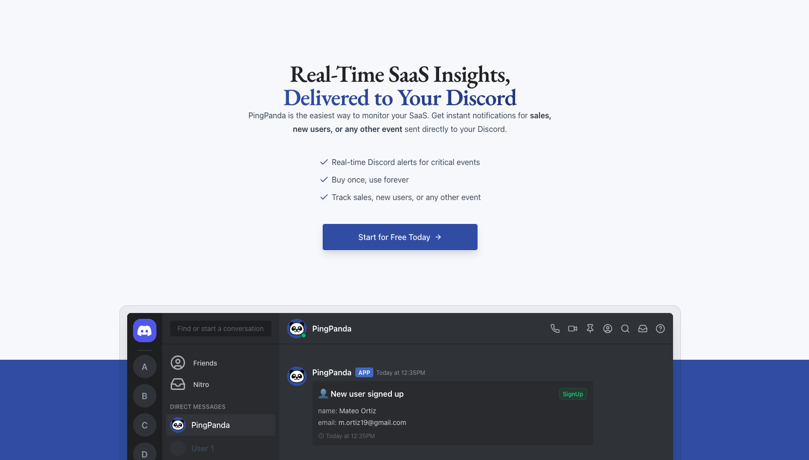

# Discord Notifier



Generate custome discord notifications that you can integrate into any application by simply calling the publicly exposed API endpoint! Here is an example below of client side code that does just that:

```js
await fetch("http://localhost:3000/api/v1/events", {
  method: "POST",
  body: JSON.stringify({
    category: "sale",
    fields: {
      plan: "PRO",
      email: "zoe.martinez2001@email.com",
      amount: 49.0,
    },
  }),
  headers: {
    Authorization: "Bearer <YOUR_API_KEY>",
  },
})
```

To start, create an account on the website, setup event categories that you would like our discord bot to send, and just like that, you'll be receiving custom discord notifications along with real-time analytics on our dashboard showcasing logs for all events sent through us!

## Technologies Used

- [Nextjs](https://nextjs.org/)
- [Hono](https://hono.dev/)
- [Neon](https://neon.tech/)
- [Prisma](https://www.prisma.io/)
- [Clerk](https://clerk.com/)
- [Shadcn](https://ui.shadcn.com/)
- [TanStack Table and Query](https://tanstack.com/)

## Test

Run the following command to view the website running locally:
`pnpm install && pnpm dev`
